  

  
  

<h3 align="center">⟡ featured work ⟡</h3>

  
  
  
  
  
  

<h3 align="center">⟡ toolbox ⟡</h3>

  

<h3 align="center">⟡ stats ⟡</h3>

  
  

<!-- 

art and SVGs are regenerated by <code>scripts/build.py</code> · stars refresh daily

-->
